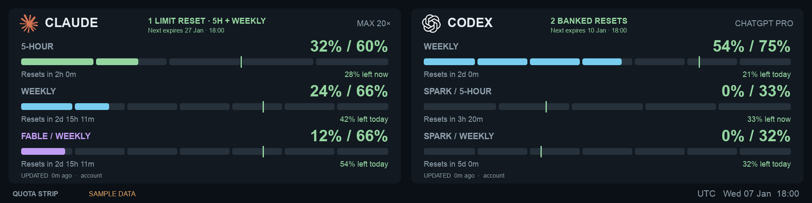

<div align="center">

# Quota Strip

**Your Claude and Codex limits, always in sight.**

A compact, native dashboard for a 1920 × 480 strip display.<br>
Runs natively on macOS and independently on Raspberry Pi.

[](https://github.com/marciogranzotto/quota-strip/actions/workflows/ci.yml)
[](LICENSE)



*The preview uses synthetic demo data. No account is needed to try it.*

</div>

## What it shows

- **Claude:** current five-hour usage, the overall weekly quota, and model-specific weekly limits such as **Fable**.
- **Codex:** the quota windows reported by your ChatGPT account, including separate **Spark** limits when available.
- **Banked Codex resets:** the available count and next expiry, read from the same account response.
- **Weekly pacing:** an end-of-day allowance marker, reset countdowns, and how much room you have left today.
- **Five-hour pacing:** a moving allowance marker based on time remaining until reset, with current headroom or over-budget usage.
- **Segmented bars:** seven equal daily portions for weekly quotas and five hourly portions for five-hour quotas, with partial segments showing exact usage.
- **Clear states:** purple for Fable, blue for other weekly meters, red for usage beyond today's allowance, and muted last-known data when a reading goes stale.

The dashboard reads subscription quotas, not estimated token costs. It makes no inference requests and runs without a browser, web server, or hosted service.

> **Status:** deployed on a Raspberry Pi 3 Model B v1.2 with a physically verified 1920 × 480 display, live standalone quotas, and tested app crash recovery. Standalone sign-in and real token renewal are also verified on macOS. The test Pi has an unresolved undervoltage issue; cold-boot recovery, physical network recovery, and sustained operation remain unverified. Consumer account endpoints are unofficial and can change.

## Try it

You need macOS, Python 3.9 or newer, and Git. A framework build of Python is recommended for the native window; the setup script prefers an installed Python 3.13 framework over a non-framework default interpreter.

```sh
git clone https://github.com/marciogranzotto/quota-strip.git
cd quota-strip
./setup-mac.sh
./run.sh --demo --windowed
```

For live readings, install and sign in to [Claude Code](https://code.claude.com/docs/en/overview) and [Codex](https://github.com/openai/codex), then run:

```sh
./run.sh --source local --windowed
```

Press **Esc** or **Q**, or close the window, to quit.

Each provider refreshes independently every two minutes. Network failures retain the last reading and back off before retrying. Missing data is never treated as zero usage.

## Standalone sign-in

Sign in separately for Quota Strip to run without either coding CLI:

```sh
.venv/bin/python quota_auth.py claude --browser
.venv/bin/python quota_auth.py codex
./run.sh --source standalone --windowed
```

Open the printed links to finish sign-in. Claude's `--browser` option accepts its callback on this computer; omit that option when signing in through an SSH terminal. No tokens are printed. Dedicated credentials are stored outside the repository, and the collector refreshes them automatically. Both providers' real sign-in and token renewal have been verified on macOS.

After standalone sign-in, double-click **Launch Quota Strip.command** to open the display. Existing CLI sessions remain available through `--source local`.

For Raspberry Pi OS Lite 64-bit, follow the [Pi setup guide](docs/RASPBERRY_PI.md). It covers imaging, SSH, dedicated sign-in, automatic startup, portrait-panel rotation, updates, and the [hardware validation record](docs/RASPBERRY_PI.md#hardware-validation-record-2026-09-05).

## Home Assistant

The optional [Home Assistant integration](docs/HOME_ASSISTANT.md) adds a **Display on/off switch**, **Reboot button**, and **Shutdown button** through MQTT discovery. The display can sleep while quota collection continues. It runs locally on the Pi and uses your existing MQTT broker. Starting the Pi after shutdown requires a physical power cycle or external wake hardware.

## Reading the weekly meter

A readout such as **24% / 66%** means:

- **24%** of that weekly quota has been used.
- **66%** is the allowance by the end of today, assuming an even pace across the week.
- **42% left today** is the difference, measured against the full weekly quota.

The vertical marker shows that allowance. Usage beyond it turns red. This is a pacing guide; it does not change the provider's limits or promise that a particular number of prompts will fit.

Each weekly segment represents one seventh of the quota; each five-hour segment represents one fifth. The fill shows quota consumed, not elapsed time. Segments are equal portions of the provider's window, rather than calendar-day boundaries. Other window durations retain a continuous bar. Both remaining and over-budget labels use `%` of the full quota.

```text
window start = reset time − 7 days
allowance    = 100 × (next local midnight − window start) / 7 days
```

The allowance is rounded to the nearest integer and clamped to 0–100. Midnight is calculated in the configured timezone, including daylight-saving transitions. Once a reset passes, the old reading is marked as awaiting an update.

Fable uses its own reported percentage and reset time. It also draws from Claude's overall allowance, so its meter is not extra capacity on top of the overall weekly quota.

## Reading the five-hour meter

Five-hour markers follow elapsed time within the reported window:

```text
allowance = 100 × (1 − seconds until reset / 18,000)
```

With three hours until reset, the allowance is 40%. A reading of **20% / 40%** means **20% left now** at an even pace. Usage beyond the moving allowance is labeled **over current budget**. This is pacing headroom; the unused quota remains available from the provider even when usage is ahead of pace.

The marker retains fractional precision and updates on the display's 15-second redraw schedule, independently of the two-minute provider poll. The displayed percentage is rounded. The allowance is clamped to 0–100 and is hidden for stale, expired, or missing reset information. Weekly markers continue to use local midnight.

## Banked resets

The Codex header shows saved usage-limit resets and the next expiry in your configured timezone. Local mode reads the app-server's `rateLimitResetCredits` summary. Standalone mode reads the account usage summary and the read-only reset-credit details endpoint. Checking the count does not redeem a reset.

The server's total is authoritative, even when it returns only some detail rows. Partial lists are labeled **Listed expiry** rather than claiming to show the next expiry across the whole bank. Missing data displays **Count unavailable**, never zero. When a known expiry passes or collection goes stale, the last count is marked as awaiting an update.

Only the count, earliest supplied expiry, and detail-completeness flag enter the local snapshot. Credit identifiers and descriptions are discarded. Both collection modes support this indicator. If the optional expiry request fails, standalone mode keeps the live count and ordinary quotas, reports partial data, and backs off that request independently.

No equivalent Claude banked-reset count has been verified. Claude's paid usage credits and automatic quota resets are separate concepts; the dashboard does not infer a bank from them.

## Configuration

```sh
# Set the timezone used for daily pacing.
./run.sh --source local --timezone Europe/London

# Poll every five minutes (minimum: 60 seconds).
./run.sh --source local --interval 300

# Read normalized quotas once, without opening a window.
./run.sh --json --source local
```

| Setting | Purpose |
| --- | --- |
| `--timezone` / `QUOTA_TIMEZONE` | IANA timezone for midnight and the clock; currently defaults to `America/Sao_Paulo`. |
| `--interval` | Seconds between successful reads; default `120`. |
| `QUOTA_HOME` | Runtime data directory; default `~/.config/quota-strip`. |
| `QUOTA_CODEX_BIN` | Path to the Codex executable. Setup also records the detected path in the ignored `.local-config.json`. |
| `QUOTA_PYTHON` | Python interpreter to use when running `setup-mac.sh`. |

The current header badges read `MAX 20×` and `CHATGPT PRO`; they are presentation labels, not detected subscription metadata. Quota values always come from the account response.

The layout keeps two windows visible and rotates additional windows through the third slot when a provider reports more than three. The window is fixed at 1920 × 480.

## Data sources and privacy

**In local mode, Claude** reads the existing Claude Code credentials file or macOS Keychain entry and requests account usage. It does not modify or refresh those credentials. If they expire, renew the login through Claude Code. An optional fallback reads `~/.claude/.debug/statusline-input.json` if an existing status-line setup already produces it; Quota Strip does not create or enable that capture. The status line only reports the main windows. During an account failure, those windows keep updating while previously observed model quotas such as Fable remain visible with their original timestamps and a **Last known** label. The footer reports **PARTIAL** and the account error. With no previous model reading, the display shows model limits as unavailable. Account requests back off independently of local status-line reads.

**In local mode, Codex** launches the installed CLI's app-server, requests `account/rateLimits/read`, and stops that child process after the read. No coding task is started. The CLI manages its own account session.

Runtime snapshots store normalized percentages, window labels, timestamps, and source information. The application does not collect prompts, transcripts, or email addresses. It has no telemetry. Credentials are sent only to their provider's account endpoints; provider errors are sanitized before display.

Local configuration, credentials, snapshots, logs, virtual environments, and process IDs are excluded from Git. Generated screenshots can contain your usage information—use `--demo` for images you intend to share.

## Development

The dashboard's only runtime dependency outside the Python standard library is **Pygame**. The optional Home Assistant controller also uses **Paho MQTT**. No frontend build step is required.

```sh
.venv/bin/python -m unittest discover -s tests -v

# Reproduce the README image without credentials or network access.
./run.sh --demo --timezone UTC --at 2026-01-07T18:00:00+00:00 \
  --screenshot docs/preview.png
```

| File | Responsibility |
| --- | --- |
| `quota_model.py` | Normalize provider windows and calculate weekly allowances. |
| `quota_local.py` | Read existing local Claude and Codex sign-ins. |
| `quota_api.py`, `quota_auth.py`, `quota_callback.py` | Standalone account requests, sign-in, and browser callback. |
| `quota_state.py` | Independent polling, backoff, caching, and stale readings. |
| `quota_display.py` | Native rendering, demo mode, and command-line options. |
| `quota_ha.py`, `setup-home-assistant.sh` | Optional MQTT discovery, display control, and Pi power buttons. |
| `setup-pi.sh`, `deploy/pi/` | Pi installation, LightDM session, and systemd app recovery. |

Tests cover provider parsing, model-specific quotas, midnight and DST boundaries, stale data, atomic storage, and mocked authentication contracts. CI also checks shell scripts and systemd units and renders the demo headlessly. Hardware validation separately covers the real display and session lifecycle.

## Roadmap and limits

- [x] Native 1920 × 480 macOS dashboard.
- [x] Claude, Fable, Codex, and Spark quota windows.
- [x] Weekly pacing, reset countdowns, and stale-data handling.
- [x] Verify independent sign-in and real token renewal on macOS.
- [x] Exercise network failures, expired credentials, backoff, and cache recovery with automated tests.
- [x] Deploy on a Raspberry Pi 3 Model B v1.2 with automatic graphical login configured.
- [x] Verify the physical HDMI panel at 1920 × 480, including persistent rotation.
- [x] Verify app crash recovery without ending the graphical session, and clean session shutdown.
- [x] Add Home Assistant MQTT discovery and verify live display power controls.
- [ ] Resolve undervoltage on the test Pi and verify cold-boot recovery with the Mac disconnected.
- [ ] Validate physical network recovery and sustained unattended operation on the Pi.
- [ ] Validate resource usage across quota resets and token renewal on the Pi.

Standalone mode uses appliance-owned credentials. Tests exercise callback validation, expired-token renewal, retry limits, network recovery, optional metadata failures, and cache restoration. The consumer usage endpoints are not a stable public integration API and may change.

This project does not track every ChatGPT feature, API billing, extra-usage credit balances, or a guaranteed number of remaining messages. `install.sh` selects the Mac or Raspberry Pi installer. Passing the automated tests or seeing a working display does not establish power stability or unattended reliability.

## Credits

Adapted from [fuziontech/claude-quota-display](https://github.com/fuziontech/claude-quota-display), with its history and MIT license preserved. See the [research notes](docs/RESEARCH.md) for integration references.

Provider icons come from [Lobe Icons](https://github.com/lobehub/lobe-icons); source details and licensing are in [assets](assets/README.md). Claude and OpenAI/ChatGPT marks belong to their respective owners. This project is not affiliated with or endorsed by Anthropic or OpenAI.

[MIT license](LICENSE).
